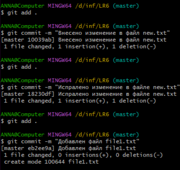

# LR6
Лабораторная работа №6
# Отчет по работе с Git

## 1. Создание форка
Создан форк в личное хранилище из https://github.com/Kurtyanik/LR6/

## 2. Установка Git
Был установлен Git

## 3. Изменение имени пользователя
Команда для изменения имени пользователя:

```bash
$ git config --global user.name "Группа 4317 Яковлева А.И."
```
Команда для изменения почты пользователя:

```bash
$ git config --global user.email "yakovleva2005anna@gmail.com"
```
*Результаты изменения имени и почты пользователя*


## 4. Клонирование репозитория

```bash
$ git clone https://github.com/Annesy05/LR6
```
*Скриншот с клонированием репозитория*


## 5. Добавление нового файла

*Скриншот с добавлением нового файла*


## 6. Добавление изменений в локальный репозиторий

```bash
$ git pull
```
*Скриншот с добавлением изменений в локальный репозиторий*


## 7. Получение данных для каждой из веток

```bash
$ git log --oneline --graph --all
```

*Результат работы команды*


## 8. Просмотр последних изменений

```bash
$ git log -1
```

*Результат работы команды*


## 9. Решение конфликта и слияние веток

```bash
$ git checkout master
$ git marge origin/branch1
```
Решение конфликта с помощью редактора nano путем замены содержимого mergefile.txt в ветке branch1

*Результат работы команды*


## 10. Удаление побочной ветки после слияния

```bash
$ git branch -d origin/branch1 --remote
```
*Результат работы команды*


## 11. Создание изменений и их фиксирование.

Создание нескольких изменений и коммиты для них

*Создание изменений и их фиксирование*




## 12. Откат коммита

Откат к предыдущему коммиту:

```bash
$ git reset --hard HEAD~1
```
*Результат работы команды*


## 13. Создание ветки для отчета

```bash
$ git checkout -b report
```
*Результат работы команды*


## 14. Получение истории операций в форматированном виде

```bash
$ git log --pretty=format:"%h %ad %an %s" --date=short
```

## 15. Логи команд

```bash
$ git config --global user.name "Группа 4317 Яковлева А.И."
$ git config --global user.email "yakovleva2005anna@gmail.com"
$ git clone https://github.com/Annesy05/LR6
$ git pull
$ git log --oneline --graph --all
$ git log -1
$ git checkout master
$ git marge origin/branch1
$ git branch -d origin/branch1 --remote
$ git reset --hard HEAD~1
$ git checkout -b report
$ git log --pretty=format:"%h %ad %an %s" --date=short
```

## 16. История операций
Список истории операций:
+ a291bf4 2024-11-21 Группа 4317 Яковлева А.И. Отчёт закончен
+ e4c7ff0 2024-11-21 Группа 4317 Яковлева А.И. Внесены обновления в отчёт
+ 4a34361 2024-11-21 Группа 4317 Яковлева А.И. Создан отчёт и папка со скриншотами
+ 18230df 2024-11-21 Группа 4317 Яковлева А.И. Испралено изменение в файле new.txt
+ 10039ab 2024-11-21 Группа 4317 Яковлева А.И. Внесено изменение в файл new.txt
+ 3ec2be6 2024-11-21 Группа 4317 Яковлева А.И. Merge remote-tracking branch 'origin/branch1'
+ 9dbfef0 2024-11-21 Annesy05 Create new.txt
+ 921f53b 2020-11-21 Kurtyanik Обновление информации
+ 0f9f50d 2020-11-21 Kurtyanik Заполнил файл
+ c08a654 2020-11-21 Kurtyanik Файл создан пустым
+ 3c6e913 2020-11-21 Kurtyanik Initial commit
